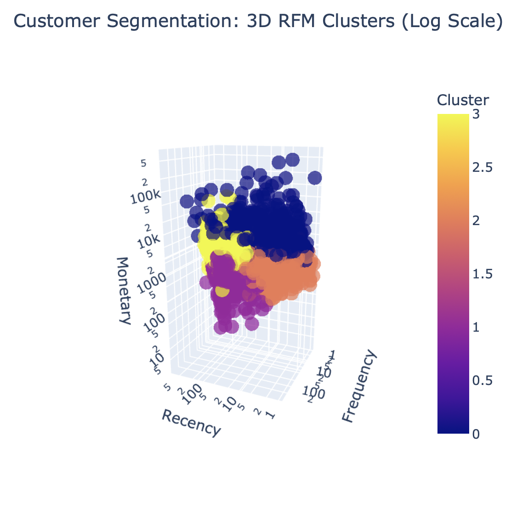

# E-Commerce Customer Segmentation (RFM + K-Means)

An unsupervised behavioral segmentation pipeline built on transactional retail records to isolate distinct customer cohorts and guide tailored retention and lifecycle marketing.

---

## 1. Business Context
Broad, non-personalized promotional campaigns dilute marketing ROI and lead to unnecessary discounting on already loyal buyers. 

This project builds an automated customer segmentation engine on retail transaction data using the **RFM (Recency, Frequency, Monetary)** framework and **K-Means clustering** to help CRM teams target campaigns by customer value and churn vulnerability.

---

## 2. Technical Workflow

- **Dataset:** Online Retail II transactional data (~500k records).
- **Data Sanitization:** Removed non-commercial transactions (postage, shipping fees), return records (negative quantities and invoice codes starting with `C`), and records missing customer IDs.
- **RFM Metric Construction:**
  - **Recency ($R$):** Days elapsed from the customer's last purchase to the snapshot date.
  - **Frequency ($F$):** Total count of unique completed orders.
  - **Monetary ($M$):** Net historical spending per customer.
- **Feature Scaling:** Corrected power-law right-skewness using a log transformation (`np.log1p`) followed by `StandardScaler`.
- **Clustering Architecture:** Evaluated cluster counts from $k=2$ to $k=8$ using the Elbow Method and Silhouette Analysis, selecting $k=4$ as the optimal trade-off between mathematical cohesion and business interpretability.

---

## 3. Segment Profiles & Visual Findings

### Behavioral Distribution
The scatter plot illustrates customer separation across Recency and Monetary dimensions (log scale):



### Identified Cohorts
- **Champions (VIP):** High spend, high purchase frequency, low recency (recent activity). Accounts for ~50–60% of total revenue.
- **Loyal Accounts:** Consistent repeat order history and steady spend.
- **At Risk:** Previously high-value accounts that have been inactive for an extended period.
- **Hibernating:** Lowest order volume and low spend, inactive for months.

---

## 4. Business Impact & Strategy Matrix

| Customer Cohort | Revenue Share | Primary Risk | Recommended CRM Strategy |
| :--- | :---: | :--- | :--- |
| **🏆 Champions** | **~55%** | Competitor poaching | Early product drops, dedicated VIP support, loyalty rewards. Avoid aggressive discounts. |
| **⭐ Loyal** | **~25%** | Value stagnation | Cross-selling, product bundles, and personalized upselling to increase basket size. |
| **⚠️ At Risk** | **~15%** | Permanent churn | Automated win-back sequences with targeted discounts on past favorite categories. |
| **💤 Hibernating** | **< 5%** | Sunk ad spend | Low-cost automated email reactivation; exclude from paid paid retargeting. |

---

## 5. Strategic Recommendations

1. **Protect VIP Margin:** Suppress sitewide markdown campaigns for Champions; replace price cuts with service perks to preserve gross margins.
2. **Win-Back Triggers:** Set proactive automated notifications when an account's Recency exceeds 90 days past their expected purchase cycle.
3. **Ad Spend Optimization:** Filter out Hibernating customers from paid Meta/Google re-engagement lists, cutting wasted ad spend.

---

## 6. Quickstart

Run directly in Google Colab:

[](https://colab.research.google.com/github/MRigoni10/customer-segmentation-rfm/blob/main/notebooks/rfm_segmentation.ipynb)

To run locally:

```bash
git clone [https://github.com/MRigoni10/customer-segmentation-rfm.git](https://github.com/MRigoni10/customer-segmentation-rfm.git)
cd customer-segmentation-rfm
pip install -r requirements.txt
jupyter notebook
